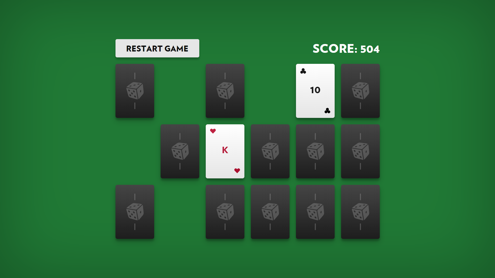

# Memory Game

React application "Memory Game".

## Objective

Implement a web interface and client-side logic for the card game "Memory" according to the provided rules and design.

### Game Rules

"Memory" is a single-player card game. The player flips any two cards per turn. If the flipped cards form a pair of the same suit and rank, they are removed from the board, and the player earns points. If the cards do not match, they are turned back face down, and the player's score decreases.

Points are recalculated on each turn as follows:

- When a matching pair is found, the score increases by the number of unrevealed pairs multiplied by 42.
- When the cards do not match, the score decreases by the number of revealed pairs multiplied by 42.

## Task Requirements

1. The task must be implemented using the following technologies: HTML, CSS, React, TypeScript.
2. The application code should include necessary comments.
3. The application must function correctly in all modern browsers.
4. Graphics should be implemented using CSS and TypeScript, with minimal use of raster images.
5. The interface should be visually appealing and encourage repeated gameplay.
6. The game should look like a complete and polished product.

## Tags

React, TypeScript, HTML, CSS, CSS-in-JS, Emotion, animations, algorithms and data structures, ESLint, Prettier

## Screenshots

## Demo

A working version of the application is deployed on GitHub Pages.

**[Launch Demo!](https://nshaikhinurov.github.io/memory-game/)**

## Author

**Nail Shaikhinurov**

Telegram: [@nshaikhinurov](https://t.me/nshaikhinurov), email: n.shaikhinurov@gmail.com

